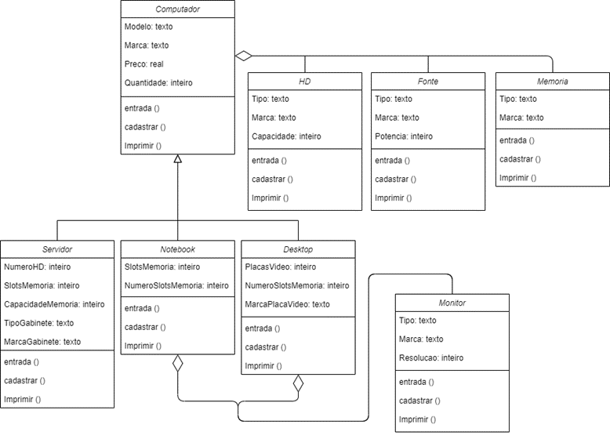

# App para empresa de venda de computadores com POO

# Introdução

A Programação Orientada a Objetos, também conhecida como POO, corresponde a um padrão de desenvolvimento que é seguido por muitas linguagens, como C# e Java, e tem como característica a representação de cada elemento em termos de um objeto, ou classe. Esse tipo de representação procura aproximar o sistema que está sendo criado ao que é observado no mundo real, e um objeto contém características e ações, assim como vemos na realidade, o que traz algumas vantagens para desenvolvedores e usuários, como a reutilização de código (diminuindo o tempo de desenvolvimento e número de linhas de código), maior facilidade na leitura e manutenção de código, criação de bibliotecas, entre outras.
Sendo assim, o objetivo deste trabalho é o desenvolvimento de uma aplicação para uma empresa de venda de computadores, utilizando conceitos de Particionamento, Agregação e Herança.

# Procedimento

A aplicação deverá gerenciar as quantidades e os preços de três diferentes tipos de computadores (Desktop, Notebook e Servidor) e cada objeto deve ser instanciado a partir do modelo do Computador, conforme atributos:

## Classe Servidor

### Atributos

- Marca: texto
- Preço: real
- Quantidade: inteiro
- NúmeroHD: inteiro
- SlotsMemória: inteiro
- TipoMemória: Texto
- MarcaMemória: Texto
- CapacidadeMemória: inteiro
- TipoHD: Texto
- MarcaHD: Texto
- CapacidadeHD: inteiro
- TipoGabinete: Texto
- MarcaGabinete: Texto
- TipoFonte: Texto
- MarcaFonte: Texto
- PotênciaFonte: inteiro

### Métodos

- De acesso (Setters & Getters) para todos os atributos;
- Pelo menos 5 métodos construtores;
- imprimir (para todos os atributos);
- cadastrar (para todos os atributos);
- entrada (entrada de dados para todos os atributos).

## Classe Notebook

### Atributos

- Marca: texto
- Preço: real
- Quantidade: inteiro
- SlotsMemória: inteiro
- TipoMemória: Texto
- MarcaMemória: Texto
- NumeroSlotsMemória: inteiro
- TipoHD: Texto
- MarcaHD: Texto
- CapacidadeHD: inteiro
- TipoMonitor: Texto
- MarcaMonitor: Texto
- ResoluçãoMonitor: inteiro
- TipoFonte: Texto
- MarcaFonte: Texto
- PotênciaFonte: inteiro

### Métodos

- De acesso (Setters & Getters) para todos os atributos;
- Pelo menos 5 métodos construtores;
- imprimir (para todos os atributos);
- cadastrar (para todos os atributos);
- entrada (entrada de dados para todos os atributos).

## Classe Desktop

### Atributos

- Marca: texto
- Preço: real
- Quantidade: inteiro
- PlacasVídeo: inteiro
- TipoMemória: Texto
- MarcaMemória: Texto
- NumeroSlotsMemória: inteiro
- TipoHD: Texto
- MarcaHD: Texto
- CapacidadeHD: inteiro
- TipoMonitor: Texto
- MarcaMonitor: Texto
- ResoluçãoMonitor: inteiro
- TipoFonte: Texto
- MarcaFonte: Texto
- PotênciaFonte: inteiro
- MarcaPlacaVideo: texto

### Métodos

- De acesso (Setters & Getters) para todos os atributos;
- Pelo menos 5 métodos construtores;
- imprimir (para todos os atributos);
- cadastrar (para todos os atributos);
- entrada (entrada de dados para todos os atributos).

## Diagrama de Classes

Após avaliação dos atributos, as classes foram organizadas da seguinte forma:

Desta forma, foram criadas as classes com seus respectivos atributos e métodos, começando pelas Agregadas, que são necessárias nos objetos principais, seguida da SuperClasse Computador e das SubClasses Servidor, Notebook e Desktop. Por fim, foi feita a classe AppHerancaAgregacao para criar 3 objetos de cada tipo.
